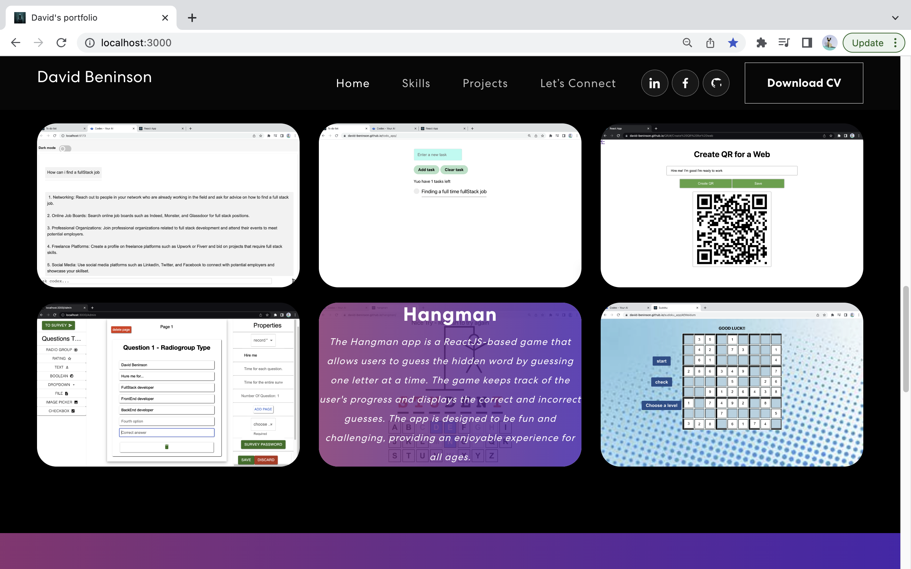

<body>
	<h1>Portfolio App</h1>
	
This is a simple Portfolio app built using React.js, where you can showcase your work, skills and experience.

	

<h2>Getting Started</h2>

Follow these instructions to get the project up and running on your local machine.

<h3>Prerequisites</h3>
<ul>
	<li>Node.js</li>
	<li>npm</li>
</ul>

<h3>Installing</h3>
<ol>
	<li>Clone the repository</li>
	<pre><code>https://github.com/David-Beninson/Portfolio-App.git</code></pre>
	<li>Install dependencies</li>
	<pre><code>cd Portfolio-App
npm install</code></pre>
</ol>

<h3>Running the app</h3>
<pre><code>npm start</code></pre>

This will start the development server and open the app in your default browser at <a href="http://localhost:3000">http://localhost:3000</a>.

<h3>Building for production</h3>
<pre><code>npm run build</code></pre>

This will create a production build of your app in the <code>build</code> folder.

<h2>Built With</h2>
<ul>
	<li>React.js</li>
	<li>Bootstrap</li>
</ul>

<h2>Authors</h2>

David Beninson

Judy Gabud

<h2>Acknowledgments</h2>
<ul>
	
This project was built using the personal-portfolio project by Judy Gabud as a reference. You can find the original code here: <a href="https://github.com/judygab/web-dev-projects/tree/main/personal-portfolio">https://github.com/judygab/web-dev-projects/tree/main/personal-portfolio</a>.

</ul>

<h2>Feedback and Support</h2>

If you have any questions, feedback, or need any help, please feel free to contact me at Davidbeninson@email.com.

<h2>Screenshot</h2>

</body>
